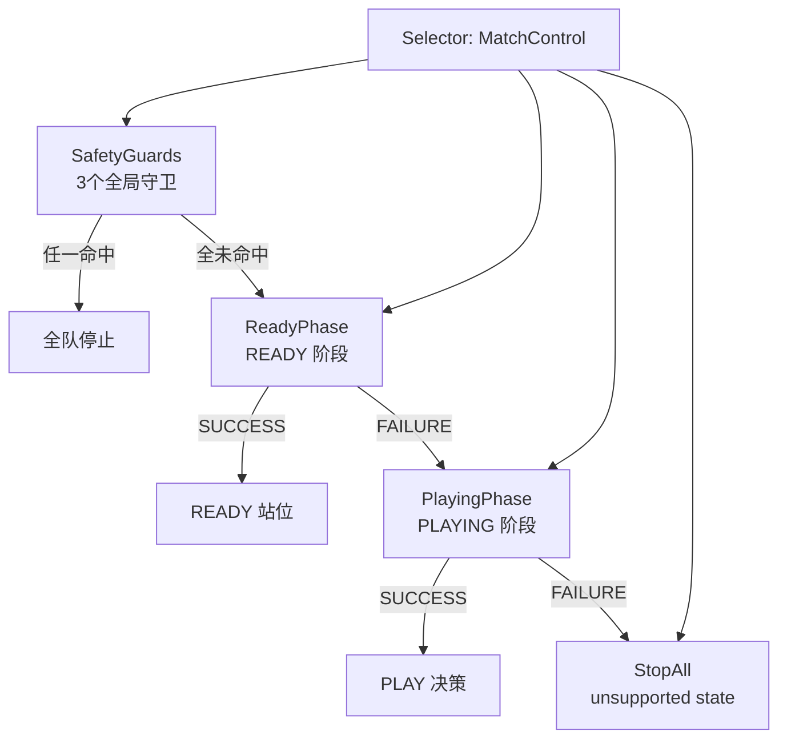

# behavior_tree

Source: https://booster.feishu.cn/wiki/Utk1wvBjhiMaTZkCWTiciPchnyh
Fetched: 2026-07-10 18:14:02 CST

# 示例策略的行为树设计

<blockquote><p>English version: <cite doc-id="SHpHwtX8wi8ftckipGectjv2nKh" file-type="wiki" title="Behavior Tree Design of the Example Strategy" type="doc"></cite></p></blockquote>

## 行为树控制结构的特点

机器人足球比赛注重实时对抗。机器人每秒需要进行数十次决策，不断根据球的位置、队友位置、对手位置以及比赛状态调整自己的行为。

相比传统的 if...else 或状态机，行为树具有**结构清晰、易于扩展、可复用性高**等优点，因此成为游戏 AI 和机器人领域广泛采用的决策架构。

示例代码使用了 **py_trees** 库实现行为树。py_trees 提供了成熟的行为树框架，自带 Tick 调度机制，并支持各种复合节点、装饰节点以及状态管理，能够很好地满足机器人足球高频实时决策场景。

在行为树中，我们可以把每一个"判断"、"计算"、"动作执行"都抽象成一个节点，再通过不同类型的控制节点将这些节点组织起来，从而形成完整的决策流程。

### 行为树的节点状态

行为树每个节点执行结束后，都返回执行状态。状态可以是`SUCCESS`，`FAILURE`或者`RUNNING`。节点返回的状态决定了父节点下一步如何继续执行，也是行为树中各个节点之间沟通的唯一方式。

行为树有Sequence，Selector，Parallel三类复合节点，可以按特定执行逻辑组织子节点。

### Sequence 顺序节点

Sequence节点会按添加顺序逐个执行子节点，遇`FAILURE` / `RUNNING`就终止，全部`SUCCESS`才返回成功。因此，它非常适合描述**必须一步一步完成的任务流程**。

例如，一个日常生活中的"出门上班"流程，由四个节点组成：起床 > 洗漱 > 穿衣 > 出门。

如果洗漱SUCCESS，会继续穿衣；如果穿衣RUNNING，状态停留在这里，下一个判断周期(Tick)再继续穿衣；如果穿衣FAILURE，流程立即失败，不会出门。


这就是 Sequence 的特点：**前面的步骤必须完成，后面的步骤才能开始。**

机器人足球中，发现足球 > 移动到足球附近 > 调整朝向 > 踢球 的流程也是类似的逻辑。这类具有明确先后顺序的任务，非常适合使用 Sequence 节点组织。

### Selector 选择节点

Selector节点按顺序尝试子节点，找到第一个成功的就终止；全失败才返回失败。因此，它非常适合描述**多种备选方案**。

例如，日常生活中选择出行方式，由三个节点组成：骑自行车 > 开汽车 > 坐地铁。

如果自行车坏了（FAILURE），汽车限号（FAILURE），那么坐地铁（SUCCESS）。Selector会一路尝试，直到找到可以使用的交通方式，然后返回SUCCESS，如果找不到，最终返回FAILURE。


Selector体现的是一种**"哪个方案能成功，就采用哪个方案"**的思想。

当机器人在足球场上尝试进攻时，可以按优先级依次尝试：直接射门 > 传球 > 带球推进。如果当前位置能够直接射门，就立即执行射门；如果射门条件不足，再尝试寻找队友传球；如果仍然没有传球机会，就继续带球。这种优先级决策是 Selector 典型的应用场景。

### Parallel 并行节点

Parallel节点同时运行所有子节点，根据策略规则判定自身最终状态，是唯一支持并发的复合节点。策略规则有四种组合策略：

| 组合方式 | 成功条件 | 失败条件 | 使用场景 |
|-|-|-|-|
| `SuccessOnAll` + `FailureOnOne` | 所有子节点都 SUCCESS | 任意一个子节点 FAILURE | 多传感器同时在线 |
| `SuccessOnOne` + `FailureOnAll` | 任意一个子节点 SUCCESS | 所有子节点都 FAILURE | 多并发探测、多信号监听 |
| `SuccessOnAll` + `FailureOnAll` | 全部成功 | 全部失败 | 互不干扰的后台并行任务 |
| `SuccessOnOne` + `FailureOnOne` | 任意一个子节点 SUCCESS | 任意一个子节点 FAILURE | 多传感器采集、多后台监控 |


机器人移动过程中，可以同时：

-  持续检测足球位置； 
-  持续检测障碍物； 
-  持续计算最佳朝向； 
-  持续执行运动控制。

这些工作彼此独立，但需要在每一次 Tick 中同时更新，因此非常适合放入 Parallel 节点统一调度。

### 总结

Sequence、Selector 和 Parallel 是行为树最核心的三种复合节点。

它们自身也是普通节点，**同样会返回 SUCCESS、FAILURE 或 RUNNING**。这意味着，一个 Sequence 可以作为另一个 Selector 的子节点，一个 Parallel 内部也可以继续嵌套多个 Sequence，从而逐层构建出复杂的决策结构。

行为树强大就在于这种**层层组合、递归嵌套**的能力。开发者只需要设计好每个节点的职责，再通过不同的复合节点进行组合，就能够搭建出清晰、易维护且可扩展的决策系统。

> 理解 **RUNNING** 状态
> 
> 机器人中的很多动作都不是一个 Tick 就能完成，例如移动到目标点、转向指定角度、等待队友接球等，都需要持续数十甚至数百次 Tick。
> 
> 因此，当节点返回 RUNNING 时，行为树不会认为任务失败，而是会在下一次 Tick 时再次从根节点开始执行。当执行流程再次到达该节点时，节点会继续上一次尚未完成的工作，直到最终返回 SUCCESS 或 FAILURE。
> 
> 持续 Tick + RUNNING"机制，使行为树既能够保持实时响应环境变化，又能够支持持续时间较长的动作执行，这也是它非常适合机器人足球实时决策的重要原因。

## 示例策略的完整行为树

为了更清晰地呈现全队行为树在单帧 Tick 时的执行流，以下给出了**细化到最末端叶子节点**的完整 Unicode 树形结构图（缩进层级代表父子节点依赖，标有 `(1，2，3)` 代表对应三位球员的同构展开结构）：

```Plain Text
TeamRoot(Sequence)
├── DataLayer(Sequence)                       ← 每一帧开始更新黑板数据
│   ├── UpdateClock                           ← 更新系统时间 /clock/now
│   ├── UpdatePlayContext                     ← 更新场地及位置真值 /play_context
│   ├── UpdateGameState                       ← 过滤 game_state 新鲜度，过期置 None
│   ├── UpdateRecentBall                      ← 过滤 ball 新鲜度，过期置 None
│   ├── UpdateRobotPoses                      ← 过滤 robot/opponent pose 新鲜度，过期置 None
│   └── UpdateRobotStatus(1,2,3)              ← 更新球员1状态 /robot_status/1,2,3
│
├── MatchControl(Selector)                    ← 根据裁判状态和安全规则做核心决策
│   ├── SafetyGuards(Selector)                ← 全局安全状态守卫，有一项异常则强行停止全队
│   │   ├── NoGameStop(Sequence)
│   │   │   ├── HasGameState (Inverter)      ← 无 GameController 状态包时命中
│   │   │   └── StopAll("no game ...")        ← 停止整队动作命令，写 Blackboard cmd 插槽
│   │   ├── AllInactiveStop(Sequence)
│   │   │   ├── IsAllPlayersInactive          ← 所有人罚下或离线时命中
│   │   │   └── StopAll("all players ...")    ← 停止整队
│   │   └── NonPlayingStop(Sequence)
│   │       ├── IsNonPlayingState             ← TIMEOUT/INITIAL/SET/FINISHED 阶段时命中
│   │       └── StopAll("non playing state")  ← 停止整队
│   │
│   ├── ReadyPhase(Sequence)                  ← 准备开球就位阶段
│   │   ├── IsGameInState(READY)              ← 仅在 READY 状态进入
│   │   └── Parallel(ReadySlots)              ← 并行控制每个球员走到准备点
│   │       └── GoReadyTarget(1,2,3)          ← 球员 1,2,3 走到 READY 站位点
│   │
│   ├── PlayingPhase(Sequence)                ← PLAYING 常规比赛阶段
│   │   ├── IsGameInState(PLAYING)            ← 仅在 PLAYING 状态进入
│   │   └── PlaybookCore(Sequence)            ← 战术博弈核心层
│   │       ├── AssignRoles(playbook)         ← 每帧运行Playbook，写角色分工到/team/roles
│   │       └── Parallel(Roles)               ← 三名球员角色对应的策略并行 Tick
│   │           └── Player(1,2,3)(Selector)   ← 细节见PlayingPhase段落
│   │
│   └── StopAll("unsupported state")          ← MatchControl 的最终兜底
│
├── SafetyOverrides(Parallel)                 ← 硬件状态兜底层
│   └── PlayerSafety(1,2,3)(Sequence)         ← 球员 1,2,3 的安全覆盖与修补
│       ├── AllowedGuard(Selector)         
│       │   ├── IsGlobalSafetyActive          ← 全局安全控制是否激活
│       │   ├── AllowedStop(Sequence)
│       │   │   ├── IsPlayerDisallowed        ← 球员是否被罚下或未出场
│       │   │   └── StopPlayer(N, "penalized")← 强制覆盖本帧命令为 Stop
│       │   └── Success                       ← 常规状态直接返回 Success
│       ├── FallDownGuard(Selector)
│       │   ├── FallDownRecovery(Sequence)
│       │   │   ├── IsRobotFallen             ← 检测机器人是否处于跌倒状态
│       │   │   ├── TriggerGetUp              ← 下发起身动作包
│       │   │   └── StopPlayer(N, "recovery") ← 强制覆盖本帧移动命令为 Stop
│       │   └── Success
│       └── WalkModeGuard(Selector)
│           ├── WalkModeRecovery(Sequence)
│           │   ├── IsNotWalkMode             ← 当前未处于正常行走模式
│           │   ├── IsWalkModeRequired        ← 上层指令本帧发出了移动命令
│           │   └── TriggerEnterWalkMode      ← 强行覆盖为切行走模式包
│           └── Success
│
└── CommitTeamCommands                        ← 收拢指令，发送给机器人执行器
```

> 为了方便选手修改，PLAYING 阶段子树在`src/play/`中

行为树是Agent的调度中枢。Agent的所有行为，都由行为树节点发起，依据行为树的逻辑顺序执行。

行为树在`SoccerTeamRuntime`启动时中由`create_team_tree`构建。

示例代码行为树主干共有四个分支：

```Plain Text
TeamRoot(Sequence)
├── DataLayer(Sequence)                 ← 每一帧开始更新黑板数据
├── MatchControl(Selector)              ← 根据裁判状态和安全规则做核心决策
├── SafetyOverrides(Parallel)           ← 硬件状态兜底层
└── CommitTeamCommands                  ← 发送指令给机器人执行器
```

四个分支以Sequence逻辑顺序执行，即每次行为树刷新，都会依此完成4个步骤。我们依此展开讲解。

### DataLayer

DataLayer负责更新黑板上的环境信息，节点会从裁判机等数据源收集赛场信息，写入黑板。

DataLayer 是一个 **Sequence树**，按顺序依次执行：

| 节点 | 写入黑板位置 | 依赖 | 说明 |
|-|-|-|-|
| `UpdateClock` | `/clock/now` | 无 | 每帧记录当前时间戳 |
| `UpdatePlayContext` | `/world` | 无 | 从 ContextProvider 拉取本帧世界快照（含球、队友、对手、裁判状态） |
| `UpdateGameState` | 裁判规则状态 | `/world` | 解析 GameControlState，写规则相关黑板槽 |
| `UpdateRecentBall` | `/ball/state` | `UpdateClock` | 球状态 + 新鲜度判定（`ball_max_age_sec` 内有效） |
| `UpdateRobotPoses` | 机器人姿态 | 无 | 从机器人服务读取全体球员的位姿 |
| `UpdateRobotStatus × N` | `/robot_status/{N}` | 无 | 每个球员的硬件状态（mode、fall_down_state） |

DataLayer 结束后，黑板中将包含本帧所有决策所需的信息。后续节点只读黑板，不再对接数据源。

### MatchControl

MatchControl负责判断比赛阶段，根据比赛不同的阶段生成球员行动指令。



MatchControl是 Selector树，会在判定比赛阶段后，只执行此阶段的分支。

> 比赛有五种状态，每种状态下，比赛的要求各不相同，状态由裁判程序控制并发布。

| 状态 | 说明 | 要求 |
|-|-|-|
| `INITIAL` | 初始状态，等待开始 | 机器人静止 |
| `READY` | 准备状态 | 机器人走到开球站位 |
| `PLAYING` | 比赛进行中 | 机器人执行比赛策略 |
| `STOPPED` | 比赛暂停（犯规、出界等） | 机器人静止 |
| `SET` | 开球前预备 | 发球队准备，无球队静止 |

和比赛战略战术相关的策略，在MatchControl下的`PlayingPhase`分支中。示例代码已充分考虑比赛阶段、规则对行为的影响，建议参赛者重点关注PlayingPhase中的策略。

### MatchControl中的PlayingPhase

PlayingPhase 只有当比赛状态为 PLAYING 时才会进入，内部是 `Sequence(IsGameInState(PLAYING) → AssignRoles → Roles)`。三个节点会依此执行。

其中，`IsGameInState(PLAYING)`用于判断当前比赛阶段是否为`PLAYING`，只有是，才会进入下一个节点。

`AssignRoles`调用 `Playbook.assign_roles(context)` 生成角色分配快照，写入黑板 `/team/roles`。

`Roles`是`Parallel`节点，**并行运行**三个球员的 Player Selector分支。每个分支结构如下。

```Plain Text
Selector(Player(N))
├── Sequence (KickoffHold (N))
│ ├── IsOpponentKickoffActive ← 对方 kickoff 未开放球权
│ └── GoReadyTarget (N) ← 非开球方保持 ready 位置
├── Sequence (PenaltyAvoid (N))
│ ├── IsOpponentRestartActive ← 对方定位球 / 重开球正在进行
│ └── AvoidOpponentRestart (N) ← 过近时避让，已安全则停止
├── Sequence (PenaltyStopped (N))
│ ├── IsGameStopped ← 裁判 stopped=true
│ └── StopPlayer (N, "game stopped")
├── Sequence (AsChaser (N))
│ ├── IsRole<chaser>(N)
│ └── Selector(ChaserKickOrApproach(N))
│ ├── Sequence(ChaserKick(N))
│ │ ├── IsInKickRange(N)
│ │ └── ChaserKickAction(N)
│ └── ChaserApproachAction(N)
├── Sequence(AsSupporter(N))
│ ├── IsRole<supporter>(N)
│ └── MoveToRoleTarget(N)
├── Sequence(AsGoalkeeper(N))
│ ├── IsRole<goalkeeper>(N)
│ └── MoveToRoleTarget (N)
├── Sequence (AsDefender (N)) ← 供扩展的自定义 defender 分支
│ ├── IsRole<defender>(N)
│ └── MoveToRoleTarget (N)
└── WaitForBall (N) ← 没分到角色或球丢失时的兜底动作叶
```

三个守卫分支（KickoffHold / PenaltyAvoid / PenaltyStopped）在角色执行之前，保证规则优先于策略。

各 Role 分支顺序等于 `Playbook.role_registry` 的注册顺序（默认 chaser → supporter → goalkeeper）。

最后兜底接 `WaitForBall`——当球丢失、或者角色分配为空时，跳过所有角色分支，球员停在球附近等待。

### SafetyOverrides

SafetyOverrides 的职责是**在命令下发前，按球员独立修补异常（罚下 / 摔倒 / 模式错误），保证下发的命令安全可执行。**它在 MatchControl 之后、CommitTeamCommands 之前执行，用于修补本帧的命令。

每个球员在SafetyOverrides中都会依此经过三层守卫，三层守卫的分工：

1. **AllowedGuard**：如果球员被处罚或未上场 → 发送 StopPlayer 覆盖本帧命令。特别注意：这里先检查 `IsGlobalSafetyActive`——若 SafetyGuards 已经发出了全局停止，则跳过重复的 StopPlayer，避免覆盖全局停止的 reason。
2. **FallDownGuard**：如果球员摔倒（`fall_down_state != normal`）→ 触发 `TriggerGetUp`（仅副作用，带重试节流）+ 发送 `StopPlayer "fall down recovery"`。注意：`getting_up` 也算"非 normal"，起身过程中本帧仍禁用动作命令。
3. **WalkModeGuard**：如果球员不在 walk 模式 **且** 本帧 BT 命令需要 walk（非 stop/noop）→ 触发 `TriggerEnterWalkMode` 异步切换模式。这里的关键约束是 `IsWalkModeRequired`——它会检查本帧 BT 已写入的 `/cmd/{player_id}` 是否包含踢球或非零移动命令，只有需要 walk 的命令才触发切换，避免对罚下球员或 stop 命令反复 `set_mode`。

### CommitTeamCommands

此分支只有一个`CommitTeamCommands`节点，是行为树和 runtime 之间的唯一握手点。节点职责是给没写命令的球员补一个 stop 命令，并一次性把命令提交给 `/runtime/executor` 黑板。

