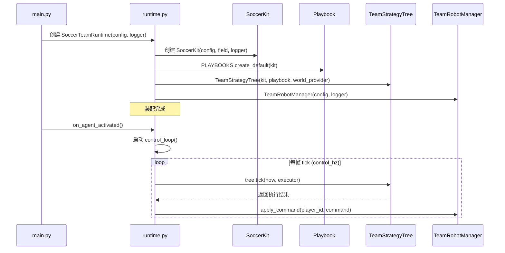
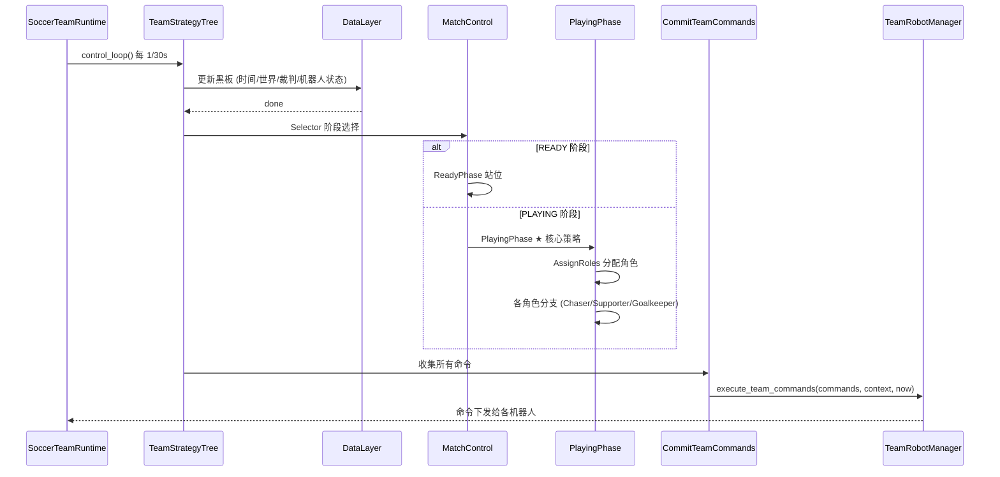
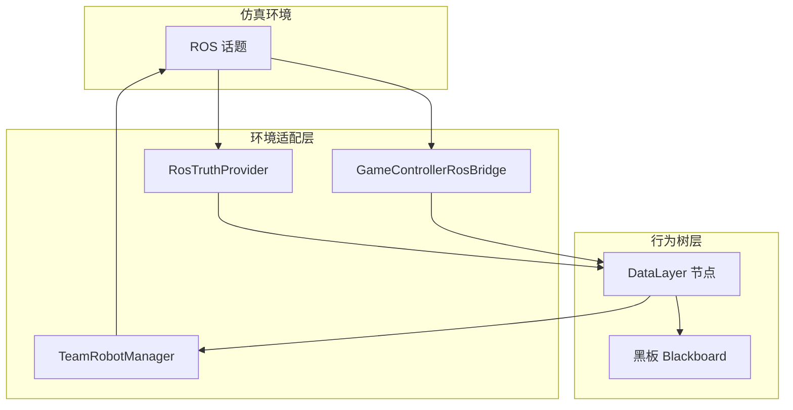

# example_strategy

Source: https://booster.feishu.cn/wiki/ArV6w7Lcuiy0nok8wWec3Cpknqf
Fetched: 2026-07-10 18:14:02 CST

<title>入门示例策略</title>

<blockquote><p>English version: <cite doc-id="CZPhwNPi7icgzEkcDGWcQwX5nIb" file-type="wiki" title="Getting Started Example Strategy" type="doc"></cite></p></blockquote>

## 导言

机器人足球 Agent，是一个持续运行的决策程序。

比赛开始后，Agent持续接收赛场信息，例如足球的位置、队友的位置、裁判状态等，然后根据当前局势决定每名机器人应该采取什么行动，例如追球、接应、射门或回防。赛场动态瞬息万变，Agent 需要持续感知、持续决策。

本模块以赛事官方示例Agent代码，帮助你快速定位各模块职责，并以此为基础开发出自己的比赛策略。

---

## 单元1：示例策略简介

示例策略是赛事官方提供的可运行Agent示例，基于<cite doc-id="JoYXwfPB4iTqhLkCJ0ccgSXunyd" file-type="wiki" title="Booster Agent Framework Python API" type="doc"></cite>开发，符合比赛规则约束。示例策略Agent可在仿真环境中调试，参与并完成机器人3v3足球仿真赛。

示例策略Agent的核心功能是**持续高频接收比赛信息，计算策略后，下达指令给机器人**。示例策略采用 **Playbook → Role → Command** 三层策略架构，**Behavior Tree** 执行引擎，高频执行控制循环，一次循环中完成下面的过程：

- **感知：**从 ROS 话题获取世界状态（球员位置、球位置），从 GameController 获取裁判状态。
- **决策：**通过行为树（Behavior Tree）做出策略决策，生成行动指令。
- **执行：**下发行动指令给机器人执行。

示例策略可帮助选手理解比赛交互逻辑，支持二次开发自定义战术。选手可在Booster Studio仿真环境中调试策略。

> 如何获得示例策略？
> 
> - 在Booster Studio中选择使用3v3足球场景新建agent时，会自动在项目文件夹中生成示例策略。

---

## 单元2：代码目录结构

示例策略可划分为5层，职责不同，协同工作。机器人足球的复杂性决定了每一层要解决多个问题，并与其他层存在依赖关系。

| 名称 | 文件 | 职责 | 依赖 |
|-|-|-|-|
| 装配层 | main.py + runtime.py | Agent 生命周期管理、ROS 通信、控制循环、组装所有子系统 | 所有下层 |
| 行为树层 | behavior_tree/ | 基于 py_trees 的帧级决策：数据→守卫→战术→安全→提交 | 所有下层 |
| 策略层 | play/ | 角色分配、Playbook 注册、踢球/走位/守门策略 | 所有下层 |
| 战术工具层 | tactics/ | 避障、目标选择、坐标变换、踢球迟滞 | 所有下层 |
| 环境适配层 | soccer_framework/ | 数据类型契约、配置系统、ROS 适配器、执行命令 | 不依赖其他 |

其中，每一层包含若干组件，组件职责如下图所示。下文我们会逐层讲解。

#### 文件结构示意图（点击展开）

```Plain Text
src/
├── __init__.py
├── main.py                          ← 进程入口 + Agent 生命周期
├── runtime.py                       ← 控制循环装配层 (SoccerTeamRuntime)
│
├── behavior_tree/                   ← 行为树框架
│   ├── blackboard.py                ← 黑板 Key 定义 + BlackboardClient 包装
│   ├── tree.py                      ← TeamStrategyTree 顶层装配 + create_team_tree
│   ├── ready_subtree.py             ← READY 阶段子树
│   ├── safety_subtree.py            ← SafetyGuards + SafetyOverrides
│   ├── play_subtree.py              ← PLAY 子树 + 角色分支创建
│   └── nodes/
│       ├── data.py                  ← 数据层叶节点 (UpdateClock/World/Ball...)
│       ├── conditions.py            ← 条件叶 (HasGameState/IsInKickRange...)
│       └── actions.py               ← 动作叶 (StopAll/CommitTeamCommands/GoReady...)
│
├── play/                            ← PLAY 阶段策略（可热插拔）
│   ├── __init__.py                  ← 公共导出 + DefaultPlaybook 注册
│   ├── playbook.py                  ← Playbook 基类 + DefaultPlaybook + RoleAssignment
│   ├── role.py                      ← RoleStrategy 基类 + IsRole + RoleRegistry
│   ├── default_roles.py             ← Chaser/Supporter/Goalkeeper 默认角色
│   ├── nodes.py                     ← AssignRoles/KickAction/MoveToTarget/build_attack_subtree
│   └── registry.py                  ← PlaybookRegistry + PLAYBOOKS 全局单例
│
├── soccer_framework/                ← 环境适配层 (数据类型 + ROS 适配)
│   ├── types.py                     ← 全部核心数据类型
│   ├── config.py                    ← SoccerConfig + SoccerStrategyTuning
│   ├── game_state.py                ← GameController JSON 解析
│   ├── game_controller.py           ← ROS GameController topic 适配器
│   ├── ros_truth.py                 ← RosTruthProvider (ROS 真值订阅) 
│   ├── robot.py                     ← RobotClient + TeamRobotManager
│   └── telemetry.py                 ← 结构化日志
│
└── tactics/                         ← 战术工具库（纯函数风格）
    ├── geometry.py                  ← field_to_relative/relative_to_field + TeamFieldFrame
    ├── motion.py                    ← MotionController (避障+行走+踢球)
    ├── navigation.py                ← Obstacle/ObstacleCollector
    ├── kick_hysteresis.py           ← KickHysteresis 迟滞模型
    ├── ready_stance.py              ← READY 阶段站位计算
    └── targeting/
        ├── predicates.py            ← 场地谓词 + ball_claim_score 抢球评分
        ├── attack.py                ← 踢球决策链 (传球/射门/带球/清球)
        ├── support.py               ← 支援站位 + 队友间距推开
        ├── recovery.py              ← 边线/底线恢复目标
        └── restart.py               ← 对方重启避让目标
```

---

## 单元3：Agent如何启动? 理解装配层

装配层由`main.py`和`runtime.py`两个文件组成，是整个程序的引擎。

<table><colgroup><col/><col/></colgroup><tbody><tr><td><h3><b>main.py是生命周期总管</b></h3><br/><code>main.py</code> 中的 <code>SoccerSimAgent</code> 是整个 Agent 的入口，也是Booster Agent Framework中最重要的类，通过两个核心钩子函数<code>on_agent_activated()</code>和<code>on_agent_close()</code>管理整个 Agent 的生命周期：<ul><li><b><code>on_agent_activated()</code></b><p>在Agent启动时触发，触发时启动 ROS spin 线程，启动 runtime 控制线程，底层调用 <code>runtime.start()</code>：启动观测订阅、创建机器人控制 client，连接机器人、起控制线程。</p></li><li><b><code>on_agent_close()</code></b><p>当 Agent 停止时触发。调用 <code>runtime.stop()</code> 安全关闭控制循环，断开与机器人的连接。</p></li></ul><blockquote><p>项目根目录的<code>agent.toml</code>中，定义的<code>entry</code>默认为<code>"src/main.py:SoccerSimAgent"</code></p></blockquote></td><td><whiteboard token="G47iwsWX4hszSYbopZxcJkGcn0c" type="mermaid">flowchart TD

A[Agent启动]
--&gt;B[创建SoccerSimAgent]

B
--&gt;C[on_agent_activated]

C
--&gt;D[启动ROS线程]

D
--&gt;E[启动Runtime]

E
--&gt;F[控制循环运行]

F
--&gt;F

F
--&gt;G[用户停止Agent]

G
--&gt;H[on_agent_close]

H
--&gt;I[停止Runtime]

I
--&gt;J[关闭ROS]

J
--&gt;K[退出]</whiteboard></td></tr><tr><td><h3>runtime.py是总装车间</h3><br/>runtime中的<code>SoccerTeamRuntime</code>在比赛过程中持续运行，维持稳定的高频控制循环，职责包括：创建工具集、加载策略、构建行为树、管理机器人交互。<br/><code>WordProvider</code>和<code>GameController</code>为<code>SoccerTeamRuntime</code>提供了比赛的背景信息<code>PlayContext</code>。<br/><code>PlayContext</code>在行为系统<code>BehaviorTree</code>的每次策略计算中提供参考数据，受<code>control_loop</code>控制高频刷新，保证决策符合当下的比赛进程。</td><td><whiteboard token="LBazwXmgQhqT7jbUtVhcjDPDncg" type="mermaid">flowchart LR

WorldProvider
--&gt;Runtime

GameController
--&gt;Runtime

Runtime
--&gt;BehaviorTree

BehaviorTree
--&gt;RobotManager</whiteboard></td></tr></tbody></table>

我们从下面的图中进一步理解启动时main.py和runtime.py的工作机制。



图中，

- **`SoccerKit`**负责封装底层的算法工具与上下文，为策略计算提供基础工具。
- **`Playbook`**负责依据当前局势，动态为主场球员分配角色并规划高层意图。
- **`TeamStrategyTree`**负责以行为树的形式，按优先级驱动数据更新、安全防御和战术执行的控制流。
- **`TeamRobotManager`**负责将逻辑命令转译为机器人的控制信号。

---

## 单元4：决策如何发生？ 理解行为树框架

机器人足球要求决策系统 **持续快速反馈 并** **在复杂环境中做出正确行动**。

机器人足球极度依赖快速反馈与并发动作控制，Agent 需要不间断地评估场上局势：谁去抢球？是否需要回防？机器人是否即将相撞？为了做出更好的决策，Agent 每秒进行几十次判断循环。

示例策略支持高频率的控制循环。每次循环称为一个tick，默认周期为1/30秒。每个tick，策略要考虑的问题非常复杂：

1. **数据更新**：当前时间、世界状态（球员位置、球位置）、裁判状态、机器人状态
2. **阶段决策**：当前是 READY 阶段还是 PLAYING 阶段？是否需要安全停止？
3. **角色分配**：谁去追球？谁支援？谁守门？
4. **动作决策**：追球者怎么跑？到球附近要不要踢？踢向哪里？
5. **安全检查**：球员是否被处罚？是否摔倒？是否需要特殊处理？

以下是简化后的示例策略行为树主干示意图

```Plain Text
Sequence(TeamRoot)
├── DataLayer (Sequence)          ← 写黑板
├── MatchControl (Selector)       ← 选阶段分支
│   ├── SafetyGuards              ← 意外紧急停止
│   ├── ReadyPhase                ← READY阶段
│   └── PlayingPhase (Sequence)   ★ 核心策略
├── SafetyOverrides (Parallel)    ← 异常覆盖
└── CommitTeamCommands
```

其中，

- **DataLayer (Sequence)**：按顺序执行，负责把外部数据写入黑板。
- **MatchControl (Selector)**：从左到右尝试，遇到第一个 SUCCESS 的分支就停止。优先级：安全守卫 > READY阶段 > PLAY阶段 > 兜底停止。
- **SafetyOverrides (Parallel)**：并行执行所有子节点。用于覆盖摔倒、罚下等异常。
- **CommitTeamCommands**：把黑板上的所有命令收集起来，交给 executor 执行。

> 行为树代码位于`/src/behavior_tree`，核心策略PlayingPhase的代码位于`/src/play`

示例策略使用了py_trees库。py_trees拥有成熟地行为树框架，自带tick方法，支持复杂节点，充分满足了机器人足球场景的需求。我们可以将每个决策点、行动点都抽象为行为树的节点，把复杂的行为逻辑抽象为三类节点不同的组合形式。以下是py_trees库的三类节点：

| 节点类型 | 作用 | 示例 |
|-|-|-|
| **Composite** | 控制子节点执行逻辑 | Sequence、Selector、Parallel |
| **Decorator** | 修饰子节点行为 | Inverter、Repeat、Timeout |
| **Leaf** | 执行具体动作或条件判断 | MoveToTarget、IsInKickRange |

和另一个常用行为控制方案`状态机`相比，`行为树`具有分层清晰，更容易调试和扩展等优点：

| 需求 | 行为树方案 | 状态机方案 |
|-|-|-|
| 安全检查 | `Parallel` 节点同时检查每台机器人，不干扰比赛逻辑 | 每个状态手写安全检查，遗漏一个就出 bug |
| 优先级分支 | `Selector` 从左到右尝试，遇 SUCCESS 立即停止 | 大量 if-else，容易遗漏 |
| 可读性 | 树结构直观反映层次关系 | 状态转移图随状态增多混乱 |
| 热插拔 | 换 Playbook = 换子树，不动框架 | 重写整个状态机 |
| 并行执行 | `Parallel` 三台机器人同时执行各自子树 | 状态机天然串行 |

行为树是示例策略的中枢，调度执行：**定期接收比赛信息，依据策略计算，下达指令给机器人** 。

下图解释了决策树在一次决策周期的主要行动：



## 单元5：战略如何设计？ 理解策略层

球队的打法风格是策略层`src/play`决定的。策略层受行为树调度。在行为树的策略判断节点执行时，策略层负责给出正确的判断，比如：

- 分配角色给球员：根据context计算，给场上的球员以使命。比如分配谁当守门员，谁追球，谁支援。示例策略中提供了3个预设的角色，也支持额外增加角色。角色是相对固定思维模式的抽象。
- 计算球员的意图：按照Role的思考方式，结合当前context，计算出每个球员在当下时间点应该做的事。

<blockquote><p><b>策略层不依赖决策树框架：</b>PLAY 策略层没有导入 py_trees库 中的任何类。这意味着你可以在完全不接触行为树代码的前提下，只修改 <code>play/</code> 目录下的文件来改变球队打法。行为树只是执行框架，PLAY是可灵活调整的战术内容。进一步阅读：<cite doc-id="QlbzwPxtBiP12nkDXBHc5D6AnGh" file-type="wiki" title="示例策略的战术设计" type="doc"></cite></p></blockquote>

## 单元6：球员如何对抗？ 理解战术工具层

角色的思维模式在战术工具层`scr/tartic`得到具象化的解释，变成可改变比赛的行动意图，比如移动到特定位置，向某一方向踢球。本层所有的组件均为无状态的纯函数，核心能力有：

- `geometry.py`：场系坐标和机器人本体坐标的相互转换
- `motion.py`：三层反应式行走控制（路径绕行 → 速度计算 → 转向避让）
- `navigation.py`：障碍物建模（对手、队友、球门结构统一为圆形）
- `targeting/`：踢球目标决策、传球评分、追球者评分、接应站位计算
- `kick_hysteresis.py`：踢球迟滞模型（防抖动）

## 单元7：比赛如何推进？ 理解环境适配层

环境适配层`src/soccer_framework` 是项目底层的基础设施。它负责获取比赛环境信息，并行动指令发送给机器人。可以把它理解为 Agent 与外部世界的翻译层。总而言之，环境适配层做两件事：接受信息和发送指令。

**接收信息：**将底层 ROS 话题及 `GameController` 的原始数据，封装转换为对上层友好的只读数据 `PlayContext`。`PlayContext`能够支持行为树、策略层、战术工具层正常工作。比如机器人做决策的第一步就是要从`PlayContext`获得比赛目前进行到什么阶段了，如果是Ready阶段，不能做任何动作。



**发送指令：** 行为树在控制周期的最后调用 `execute_team_commands`，将战术意图转化为控制指令。

```Python
def execute_team_commands(self, commands, context, now):
    """行为树每帧调用一次，把 N 个命令下发给对应机器人"""
    for player_id, command in commands.items():
        self.robot_manager.apply_command(player_id, command)
    return commands
```

这是行为树和机器人之间的**唯一接口**。未来若更换比赛平台、修改 ROS 接口或改变机器人控制模式，你只需要重写这一层，核心行为树与战术策略代码不需要做任何改动。

---

## 总结

示例策略在Agent运行时，始终是在重复执行“感知 → 决策 → 执行 → 再感知”的闭环。建议参赛选手按照以下顺序由浅入深开展二次开发：

1. **调参优化**： 修改 `soccer_framework/`config.py 中的参数，找到最适合比赛节奏的参数大小。
2. **角色重塑**： 修改 `play/default_roles.py`，重新编写 `Chaser`（追球手）的射门选择逻辑，或丰富 `Supporter`（掩护手）的跑位策略；
3. **调整战术**：修改 `playbook.py` ，增加全新的团队角色分配方案，甚至增加新的角色。
4. **架构升级**： 若想引入颠覆性的全队协同算法，可调整 `behavior_tree/` 的节点控制流。

# **FAQ**

Q1：控制循环的频率是多少？高低有什么影响？

默认频率为`30Hz`（每秒 Tick 30次），可通过设置环境变量 `SOCCER_CONTROL_HZ` 覆盖调整。提升频率可以让机器人的反应更加细腻灵敏，但会增加 CPU 的计算负担。如果单帧代码执行时间超过 $1/30$ 秒，会导致控制频率产生丢帧和掉速。

Q2：如何为我的策略新增或修改第三方 Python 依赖库？

项目统一使用根目录下`agent.toml` 管理包依赖，在 `[python.dependencies]` 节点的 `common` 数组中以 `"包名==版本号"` 的形式填写。

```Python
[python.dependencies]
common = ["py_trees==2.4.0", "scikit-learn==1.3.2"]
```

# **调整速查表**

| 想改什么 | 改哪个文件 | 改哪个类 / 方法 |
|-|-|-|
| 谁去追球 | `play/playbook.py` | `DefaultPlaybook.select_chaser()` |
| 落后全员出击 | `play/playbook.py` | `assign_roles()` |
| 射门目标 | `play/default_roles.py` | `ChaserRole.kick_target()` |
| 支援站位 | `play/default_roles.py` | `SupporterRole.target()` |
| 加新角色 | `play/role.py` | 派生 `RoleStrategy` |
| 移动速度 | `soccer_framework/config.py` | `SoccerStrategyTuning.max_linear_speed` |
| 避障参数 | `soccer_framework/config.py` | `SoccerStrategyTuning` |
| 踢球力量 | `soccer_framework/config.py` | `SoccerStrategyTuning.soccer_kick_power` |

# **参考阅读**

<cite doc-id="D5Tkwm1sEiyXf0kocpdcKppOnFd" file-type="wiki" title="Booster Agent Python 开发指南 v1.7" type="doc"></cite>

<cite doc-id="JoYXwfPB4iTqhLkCJ0ccgSXunyd" file-type="wiki" title="Booster Agent Framework Python API" type="doc"></cite>

