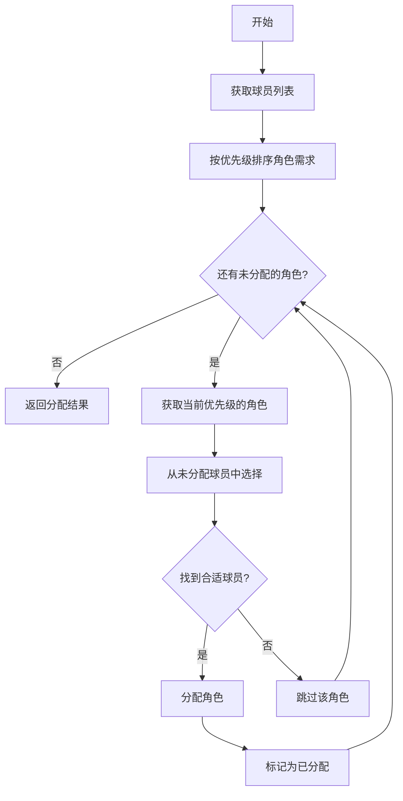

# role_assignment

Source: https://booster.feishu.cn/wiki/LY2iwt6pXi28InkVhnmcBgxQnQb
Fetched: 2026-07-10 18:14:02 CST

<title>如何为场上选手分配角色</title>

<blockquote><p>English version: <cite doc-id="A1lgwLeNMihzKVkkNoLcyFann5d" file-type="wiki" title="How to assign roles to players on the field" type="doc"></cite></p></blockquote>

<readonly-block href="https://player.bilibili.com/player.html?bvid=1EbMx6ZE6B" type="iframe"></readonly-block>

## 为什么要分配角色

在机器人足球比赛中，场上状态（球的位置、球员状态、比分等）瞬息万变。角色分配要解决的问题是：**在当前赛场动态下，教练怎样安排球员在场上行动的思考方式？**角色即对应了球员一种特定的思考方式。

基于球在场地上的位置分配角色是一种简单直观地分配方案，比如下面的分配策略：

| 球的位置 | 位置最靠后的球员 | 位置第二靠后的球员 | 位置第三靠后的球员 |
|-|-|-|-|
| 场地前 1/3 | 守门员 | 进攻角色 | 进攻角色 |
| 场地中间 1/3 | 守门员 | 防守角色 | 进攻角色 |
| 场地后 1/3 | 守门员 | 防守角色 | 防守角色 |

<figure view-type="Preview"><source mime="text/html" token="LCllbBJp7oyiEOxSKS1c1mPVnUh"/></figure>

使用这种角色分配策略，当球和对方球门距离较近时，会分配更多的进攻角色，攻势更猛。

也可以基于球员和球的距离设计角色分配策略，比如：

| 距离球最近的球员 | 距离球第二近的球员 | 距离球第三近的球员 |
|-|-|-|
| 进攻角色 | 防守角色 | 守门员 |

**分配角色的本质是安排球员做更正确的事。**

由于仿真赛中机器人配置相同，且不受电池、电机的运行状况影响，位姿（位置和朝向）是机器人间最主要的区别，也是分配角色时考虑的首要因素。评价位姿要充分考虑赛场环境：即使一个球员和球的距离最近且朝向球，但如果有对手在该球员和球之间，它也可能并不适合作为唯一的追球球员。

好的角色分配策略会充分利用场上的所有信息，包括比分信息。如果比赛快要结束，你还落后，请分配进攻角色给所有球员，放手一搏吧！

## 行为树中的角色分配节点

在示例策略的行为树框架中，每帧的 `PLAYING` 阶段， `AssignRoles` 节点都会重新分配角色。其底层架构与数据流向如下：

```Plain Text
计算分配方案的过程：
AssignRoles.update() (行为树节点)
    ├── 1. 从 RosTruthProvider 读取世界状态 → 构造 PlayContext
    ├── 2. 调用 playbook.assign_roles(PlayContext) → 返回 RoleAssignment
    └── 3. 将 RoleAssignment 写入黑板 /team/roles
            │
            ▼
使用分配方案的过程：
每个 Player 行为子树顶层的 Selector 节点 依据黑板上记录的分配信息判断角色
    ├── IsRole(1, "chaser") ───> 匹配 ───> ChaserRole.build_subtree()
    ├── IsRole(1, "supporter") ─> 匹配 ───> SupporterRole.build_subtree()
    ├── IsRole(1, "goalkeeper") > 匹配 ───> GoalkeeperRole.build_subtree()
    └── 若均未匹配 ───────────────────────> 触发 WaitForBall 兜底策略
```

`Playbook.assign_roles`方法实现了角色分配策略。方法参数`PlayContext`记录了比赛当下的各种信息。依据`PlayContext`计算出角色分配方案`RoleAssignment`会记录在黑板中。接下来，每个机器人在`IsRole`节点使用`RoleAssignment`确认自身角色，并进入角色对应的子行为树。

## Playbook类介绍

### 实例化

Runtime 初始化时，为行为树框架`TeamStrategyTree`创建 `Playbook` 实例。随后每次行为树`tick`，树的特定节点使用此`Playbook`实例分配角色。

### 数据来源

`PlayContext`来自对比赛裁判机等数据来源的持续追踪，对这些数据的理解和使用深度，决定了`Playbook` 分配角色的效果。

`PlayContext`中的信息明细见表格：

| **信息类别** | **属性/字段** | **类型** | **说明** | **数据示例** |
|-|-|-|-|-|
| 游戏状态 | context.game | GameControlState \| None | 当前游戏控制状态（可能为None） | GameControlState |
|  | context.game.state | GameState | 游戏阶段：INITIAL, READY, SET, PLAYING, FINISHED | GameState.PLAYING |
|  | context.game.game_phase | GamePhase | 正常/点球/加时/超时 | GamePhase.NORMAL |
|  | context.game.set_play | SetPlay | 定位球类型：禁区球、任意球、点球、界外球等 | SetPlay.NONE / SetPlay.CORNER_KICK |
|  | context.game.stopped | bool | 是否停止 | FALSE |
|  | context.game.kicking_team | int | 当前开球队伍ID | 1 / 2 / 255  |
|  | context.game.first_half | bool | 是否上半场 | TRUE |
|  | context.game.secs_remaining | int | 剩余时间（秒） | 300 |
| 球的状态 | context.ball | BallState \| None | 当前球的位置和信息（可能为None） | BallState / None |
|  | context.ball.x, .y | float | 球的绝对坐标位置 | x=0.5, y=-1.2 |
|  | context.ball.last_seen_at | float | 上次看到球的时间戳 | 1234567.89 |
|  | context.ball.confidence | float | 置信度 | 1.0 / 0.85 |
|  | context.known_ball | BallState | 已确认有效的球状态（无法为None） | BallState |
| 队友信息 | context.teammates | dict[int, RobotState] | 所有队友的状态字典（key=player_id） | {1: RobotState, 2: RobotState} |
|  | teammates[id].pose | Pose2D \| None | 队友的位置和朝向$x, y, theta$ | Pose2D(x=3.0, y=2.5, theta=0.785) / None |
|  | teammates[id].last_seen_at | float | 上次看到队友的时间戳 | 1234567.85 |
|  | teammates[id].is_recent  | bool | 队友信息是否最近更新过 | TRUE |
| 对方信息 | context.opponents | dict[int, RobotState] | 所有对手的状态字典（key=player_id） | {1: RobotState(...), 2: RobotState(...)} |
|  | opponents[id].pose | Pose2D \| None | 对手的位置和朝向 | Pose2D(x=-2.0, y=1.5, theta=3.14) / None |
|  | opponents[id].last_seen_at | float | 上次看到对手的时间戳 | 1234567.82 |
|  | opponents[id].is_recent  | bool | 对手信息是否最近更新过 | FALSE |
| 队伍信息 | context.game.teams[0/1] | TeamState | 我方/对方队伍信息 | TeamState(team_number=1, score=2, ...) |
|  | .score | int | 比分 | 2 |
|  | .players[id-1] | PlayerState | 具体球员的处罚状态等 | PlayerState(penalty=Penalty.NONE, secs_till_unpenalised=0) |
|  | .players[id-1].penalty | Penalty | 球员处罚类型 | Penalty.NONE / Penalty.PUSHING |
|  | .players[id-1].secs_till_unpenalised | int | 处罚剩余时间 | 0 / 30 |

### 理解Role

`Playbook` 是教练视角，职责是输出一个映射表（如 `{Player_1: "chaser", Player_2: "defender"}`）；`Role` 是球员视角，是具体角色的抽象定义。每个 `Role` 都对应一棵专职的行为子树（`Sub-tree`）。当球员被分配 `Role` 时，它就会跑这棵子树里的具体叶子节点行为（如找位、插上、拦截）。

示例策略中预设的角色有三个：

| 角色 | 职责 | 场上行为 | 子树结构 |
|-|-|-|-|
| **chaser** | 追球、控球、射门 | 始终朝向球移动，进入踢球范围后射门 | Selector → KickBranch \| MoveToTarget |
| **supporter** | 支援、接应、传球 | 站在球的侧后方，准备接应 | MoveToTarget |
| **goalkeeper** | 防守球门、禁区解围 | 站在门前，球进禁区时出击 | Selector → KickBranch \| MoveToTarget |
| **none** | 静止（扩展） | 兜底 | WaitForBall |

### 预设分配逻辑

示例代码提供了一个默认角色分配策略 `DefaultPlaybook`。其中角色分配函数代码如下：

```Python
def assign_roles(self, ctx: PlayContext) -> RoleAssignment:

    chaser_id = self.select_chaser(ctx)
    goalkeeper_id = self._configured_goalkeeper()

    mapping: dict[int, str] = {}
    for player_id in self.kit.config.player_ids:
        if player_id == goalkeeper_id:
            mapping[player_id] = ROLE_GOALKEEPER
        elif player_id == chaser_id:
            mapping[player_id] = ROLE_CHASER
        else:
            mapping[player_id] = ROLE_SUPPORTER

    return RoleAssignment(mapping)
```

`DefaultPlaybook`分配角色的逻辑是

1. 调用`select_chaser`方法找到最适合成为`chaser`角色的球员id，在配置文件中找到默认的守门员id。
2. 给队伍中最适合的球员分配角色`GAOLKEEPER`和`CHASER`
3. 给队伍中其他人分配`SUPPOTER`

推荐的角色分配的逻辑图如下：



如果你需要调整角色分配逻辑，可以重写 `assign_roles` 方法。**重写请关注：**

1. **动态少人：** 场上可能因为规则惩罚导致少人。在分配角色时，**切忌写死球员 ID**（例如固定1号当守门员）。
2. **优先级保全：** 优先分配重要的角色。参考示例策略中的分配方式：优先保全 `goalkeeper` 和 `chaser`，人少时可以不分配`supporter`。
3. **不完全分配：**`RoleAssignment`具有兜底逻辑，当出现未分配角色的球员时球员会原地待命（对应`Playbook.waiting_command`）。

## 代码示例：根据球在场上的位置调整角色

策略思路：基于球在场地上的位置分配角色，球在前半场全员进攻，球在后半场全员守门员。

```Python
def assign_roles(self, ctx: PlayContext) -> RoleAssignment:
    ball = ctx.ball
    player_ids = self.kit.config.player_ids
    all_attack = ball.x > 0
    mapping = {pid: ROLE_CHASER if all_attack else ROLE_GOALKEEPER for pid in player_ids}
    return RoleAssignment(mapping)
```

这段代码中，使用`PlayContext.ball.x`获取球的纵向坐标。x>0 意味着球在对方半场，分配进攻角色`ROLE_CHASER`给全部球员，否则分配`ROLE_GOALKEEPER`给全部球员。你可以尝试此策略和预设策略的对比效果（`/src/play/playbook.py`)。

## 总结

在设计与优化策略分配时，请牢记以下要点：

1. Playbook.assign_roles全权负责宏观角色的动态分配。
2. RoleAssignment是Playbook.assign_roles的计算结果。结果写入行为树黑板，供行为树节点读取。
3. 策略每帧重新计算，角色可能在毫秒级重新分配。
4. 考虑少人、受罚等场上最极端边界情况，确保系统具备兜底能力。

