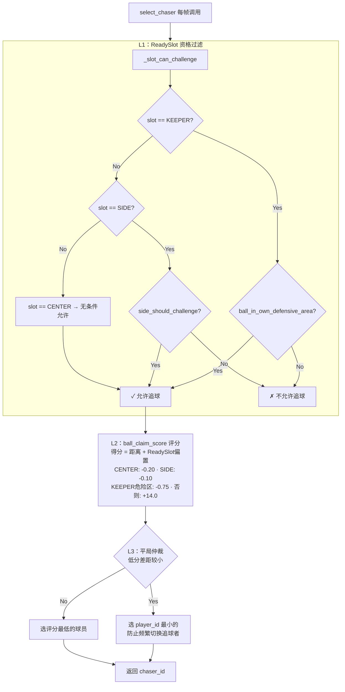

# shooter_selection

Source: https://booster.feishu.cn/wiki/G38fwu8NPiiqyzkwA14cLUq0npf
Fetched: 2026-07-10 18:14:02 CST

# 如何找到最适合的射门队员

<blockquote><p>English version: <cite doc-id="I4l4wedMRiR8kAktJuwc4MH2n0g" file-type="wiki" title="How to find the most suitable shooter" type="doc"></cite></p></blockquote>

<readonly-block href="https://player.bilibili.com/player.html?bvid=1JtMx6bEZD&amp;spm_id_from=888.80997.embed_other.whitelist&amp;bvid=BV1JtMx6bEZD&amp;vd_source=9f5e828a1512e75548042a94d63f77f3" type="iframe"></readonly-block>

找到最适合的射门队员是比赛策略最重要课题之一。示例代码策略设置一名主动进攻球员，定义为`Chaser`角色。职责是追球并完成射门。选择最适合的球员成为`Chaser`，才能最大化进攻效率。

## **追球者选择算法的思路**

追球者选择由 \`DefaultPlaybook.select_chaser()\` 实现，每帧执行一次。它是一个**三层筛选**过程：

```Plain Text
select_chaser(ctx)
  → 第一层：资格筛选（谁"能"去追球？）
    → 第二层：代价评分（谁追球"最划算"？）
      → 第三层：平局仲裁（同分时选谁？）
        → 选中 Chaser
```

Chaser 每帧只能是一个人——只有一个球员会执行追踢行为，其余人都是支援站位`Supporter`。

### 第一层：ReadySlot 资格过滤

`select_chaser` 的第一步是资格筛选，筛选掉完全不适合成为`Chaser`的机器人。

筛选和球员默认位置`ReadySlot`联系紧密。`ReadySlot`决定了球员在比赛Ready阶段所站的位置，也是球员的兜底策略会回到的位置。

> `ReadySlot`这是一个枚举类型，定义在 `src/soccer_framework/types.py`。共有三个位置：`KEEPER`,`SIDE`,`CENTER`。

这三个ReadySlot的差异贯穿了追球者选择算法和之后追球者行为逻辑：

\- **CENTER**：球队主攻手。追球代价最低（优先追球），踢球时走完整决策链（传→射→带）。

\- **SIDE**：边路辅助。只在条件合适时追球，踢球时走"只传不射门"策略——不许射门。

\- **KEEPER**：门将。正常情况不追球，只有当球进入己方危险区域（禁区范围）时才出击解围。

在第一层中，我们为不同`ReadySlot`安排的球员设定了初始判断，用`ball_in_own_defensive_area`和`side_should_challenge`两个函数限制了 KEEPER 和 SIDE 成为`Chaser`的可能性。

```Python
def _slot_can_challenge(
    self,
    slot: ReadySlot,
    ctx: PlayContext,
) -> bool:
    targeting = self.kit.targeting
    ball = ctx.known_ball
    if slot == ReadySlot.KEEPER:
        return targeting.ball_in_own_defensive_area(ball)
    if slot == ReadySlot.SIDE:
        return targeting.side_should_challenge(ctx)
    return True
```

在第一层筛选中，`ReadySlot.KEEPER`只有球进入己方禁区危险区时才可以被分配`Chaser`，`ReadySlot.SIDE`只有在`side_should_challenge`返回True的情况下才可以被分配`Chaser`。

### 第二层 计算抢球评分

对第一层筛选后，有资格成为`Chaser`的球员，分别调用`ball_claim_score`计算抢球评分，分越低，越适合成为`Chaser`。

评分 = **距离** + **槽位偏置**。分值越低越好。

| ReadySlot | 条件 | 公式 | 偏置 |
|-|-|-|-|
| CENTER | 无 | `distance - 0.20` | -0.20（最优先） |
| SIDE | 无 | `distance - 0.10` | -0.10（次优先） |
| KEEPER | 球在危险区 | `distance - 0.75` | -0.75（最高优先） |
| KEEPER | 球不在危险区 | `distance + 14.0` | +14.0（最低优先） |

举两个例子：

1. 假设球在 (2.0, 0.0)，三个球员的位置分别为：

| 球员 | ReadySlot | 位置 | 到球距离 | 评分 |
|-|-|-|-|-|
| 球员1 | CENTER | (1.0, 0.3) | 1.04 | 1.04 - 0.20 = **0.84** |
| 球员2 | SIDE | (-0.5, 2.0) | 3.20 | 3.20 - 0.10 = **3.10** |
| 球员3 | KEEPER | (-6.0, 0.0) | 8.00 | 8.00 + 14.0 = **22.00** |

因球员1评分最低，分配`CHASER`给球员1。

1. 如果球进入禁区 (-5.0, 0.0)：

| 球员 | 位置 | 到球距离 | 评分 |
|-|-|-|-|
| 球员1 | (0.0, 0.5) | 5.02 | 5.02 - 0.20 = 4.82 |
| 球员2 | (0.0, -2.0) | 5.39 | 5.39 - 0.10 = 5.29 |
| 球员3 | (-5.5, 0.0) | 0.50 | 0.50 - 0.75 = **-0.25** |

因球员3评分最低，分配`CHASER`给球员3。

### 第三层 平局仲裁

在第二层计算后，如果出现选择评分最低且差距较大，选择得分最低的机器人成为`Chaser`；如果最低得分差距 < 0.15m 时，取 player_id 最小的。

这里设置平局仲裁的原因是，当两个球员评分非常接近，意味着他们和球的距离几乎一样。球的轻微移动很容易改变两个球员的大小关系。此时选 player_id 最小的作为追球者，避免两帧之间频繁切换追球者导致行为不稳定。

<figure view-type="Preview"><source mime="text/html" token="V9sHb1ctUoQnNVxdVjDcNFDWnkm"/></figure>

三层筛选的具体流程可参考下方流程图：



## `Chaser`的决策链

当 Chaser 接近球并进入踢球范围后，`ChaserRole` 的行为树会按以下优先级逐级尝试：

1. **边线脱困**（`sideline_recovery`）：球贴边线不好踢 → 带离边线重新触球
2. **直接射门**（`kick_at_goal`）：检查射门通道是否畅通（`shot_lane_is_clear`）→ 可行则射门
3. **传给队友**（`pass_to_teammate`）：找到最佳传球目标（`best_pass_target`），要求传球路径畅通且向前推进
4. **带球前推**（`dribble`）：以上都不行 → 向对方球门方向带球推进（`dribble_target`）

Chaser 移动到球的过程由 `MotionController.move_to_target` 完成（详见<cite doc-id="AI5Qwwnrli5V97kCP2CcuSF8nRc" file-type="wiki" title="如何优化机器人移动行为" type="doc"></cite>）。进入踢球范围后，Chaser 还需根据迟滞模型（`kick_hysteresis`）判断是否真正进入/退出踢球态，避免在边界附近反复进出导致行为抖动。踢球进入距离为 `soccer_kick_enter_distance`（默认 2.5m），退出距离为 `soccer_kick_exit_distance`（默认 3.0m），并附加 1.5 秒的退出延迟。

出球决策的核心入口函数是`select_kick_target`。它逐一评估四种候选目标，为每种目标计算一个综合评分，最终选择评分最高的方案：

| 候选目标 | 评分函数 | 要求 |
|-|-|-|
| 直接射门 | `shot_score`（通行度 × 角度偏置） | `pass_enabled=True`，射门路径畅通 |
| 传球给最佳队友 | `pass_score` | `pass_enabled=True`，路径畅通，向前推进 ≥ `pass_min_forward_m` |
| 带球推进 | `dribble_score` | 目标在对方半场，非 KEEPER 角色 |
| 解围 / 大脚开出 | 低分兜底 | 以上均不可行时的最后手段 |

每种目标的评分一旦低于 `pass_min_score`（默认 0.52）就会被淘汰。此外，角色类型也影响候选范围——`SIDE` 角色的球员不允许射门（只传不射），`CENTER` 角色走完整决策链。

## 调整测试

我们可以通过测试一个极端的`select_chaser`策略来观察和默认策略的效果差异。

使用以下函数代替示例`select_chaser`，将会始终选择站位第二靠后的球员成为`CHASER`。

```Python
def select_chaser(self, context: PlayContext) -> int:

        config = self.kit.config

        scored: list[tuple[float, int]] = []
        for player_id in config.player_ids:
            robot = context.teammates.get(player_id)
            if robot is None or robot.pose is None:
                continue
            scored.append((robot.pose.x, player_id))

        if not scored:
            return min(config.player_ids)

        scored.sort()
        return scored[1][1]
```

经过观察，我们发现一旦chaser带球跑到球队最前位置就会站住。同时，中间位置的球员会立刻被分配chaser。这个策略的问题可以怎样调整呢？你可以尝试优化这种策略。

> 参考调整思路：1. 分配中间位置的球员为Chaser后，分配最前位置的球员冲向对方球门接应；2. 位置判断前，先用距离判断一次，只有在所有球员都不在球附近时执行这个策略，如果有球员在球附近，则该球员成为chaser。

### **附录：相关配置参数速查**

所有参数定义在 `SoccerStrategyTuning`（`src/soccer_framework/config.py`）：

| 参数 | 默认值 | 说明 |
|-|-|-|
| `teammate_challenge_tie_margin_m` | 0.15 | Chaser 平局判定带（米） |
| `pass_enabled` | True | 传球总开关 |
| `pass_min_score` | 0.52 | 传球候选最低评分 |
| `pass_min_forward_m` | 0.35 | 传球必须向前推进的最小距离（米） |
| `pass_lane_clearance` | 0.75 | 传球路径所需净空宽度（米） |
| `dribble_advance_m` | 1.15 | 单次带球前推距离（米） |
| `dribble_center_pull` | 0.65 | 带球向中路靠拢的比例 |
| `sideline_recovery_margin_m` | 0.90 | 离边线多近触发脱困（米） |
| `sideline_recovery_infield_m` | 1.60 | 脱困往场内拉回距离（米） |
| `sideline_recovery_advance_m` | 0.75 | 脱困同时前推距离（米） |
| `goalkeeper_challenge_margin_m` | 0.70 | 门将出击触发余量（米） |
| `soccer_kick_enter_distance` | 2.5 | 进入踢球态的距离阈值（米） |
| `soccer_kick_exit_distance` | 3.0 | 退出踢球态的距离阈值（米） |
| `soccer_kick_exit_delay_sec` | 1.5 | 退出踢球态的延迟（秒） |

