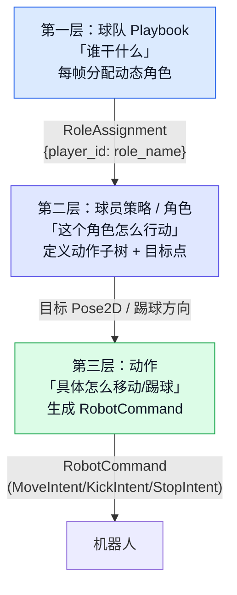

# tactic_design

Source: https://booster.feishu.cn/wiki/QlbzwPxtBiP12nkDXBHc5D6AnGh
Fetched: 2026-07-10 18:14:02 CST

# 示例策略的战术设计

<blockquote><p>English version: <cite doc-id="HItgwtJkzilwRJkpx6BcQf5InZd" file-type="wiki" title="Tactical Design of the Example Strategy" type="doc"></cite></p></blockquote>

示例策略注重攻守平衡。

场上只会有一名主动角色（Chaser），负责追球并踢球，踢球的目标可能是射门、传球或解围。Chaser可能由场上任何球员担任，球的位置等场上动态会影响Chaser的人选。同时，其他球员负责接应、保护、防守。

示例策略中，实现上述战术依赖三个重要的类：`Playbook`,`Role`,`Command`。

## Playbook

Playbook相当于人类足球中的教练员，职责是调兵遣将，安排阵容。

示例策略Agent在一场比赛中，只会使用一个Playbook，默认为`DefaultPlaybook`。

Playbook中最重要的方法是`assign_roles`，每个决策周期会根据赛场动态`PlayContext`生成一份角色安排`RoleAssignment`。这个过程就类似于教练员在思考赛场环境后决定的阵容排布，比如全员出击、两人进攻、动态攻防等等。`RoleAssignment`本质是球员与角色的对应关系。

```Python
def assign_roles(self, context: PlayContext) -> RoleAssignment:
    chaser_id = self.select_chaser(context)
    goalkeeper_id = self._configured_goalkeeper()

    mapping: dict[int, str] = {}
    for player_id in self.kit.config.player_ids:
        if player_id == goalkeeper_id:
            mapping[player_id] = ROLE_GOALKEEPER
        elif player_id == chaser_id:
            mapping[player_id] = ROLE_CHASER
        else:
            mapping[player_id] = ROLE_SUPPORTER

    return RoleAssignment(mapping)
```

示例策略的`DefaultPlaybook.assign_roles`接收唯一参数`PlayContext`，包含当前的赛场动态信息。

示例策略分配角色的计算从寻找最适合的成为`Chaser`和`Goalkeeper`开始。先调用`self.select_chaser(context)`寻找最适合成为`Chaser`的`PlayerID`，再调用`self._configured_goalkeeper()`确认最适合成为`Goalkeeper`的`PlayerID`。

然后，从`self.kit.config.player_ids`获取己方所有球员ID并遍历，遍历中优先分配`Goalkeeper`和`Chaser`，分配后如果还有球员没有角色，则分配`Supporter`角色。分配方式是构造字典描述对应关系，字典的Key是`PlayerID`，字典的Value是分配到的角色。

最终，包含所有球员分配方案的字典被实例化为`RoleAssignment类`返回。

## Role

Role对应了球员在场上的角色，可能是前锋、中场或任何具有特定行为逻辑的场上角色，你可以自己定义。

在示例策略中，角色之间的不同，最终表现为角色各自不同的行为树。进攻球员的决策树可能是追球并射门，防守队员的决策树可能是卡位并破坏。

示例策略中提供了四个默认角色，各有特点：

| 角色 | 职责 | 场上行为 | 子树结构 |
|-|-|-|-|
| **chaser** | 追球、控球、射门 | 始终朝向球移动，进入踢球范围后射门 | Selector → KickBranch \| MoveToTarget |
| **supporter** | 支援、接应、传球 | 站在球的侧后方，准备接应 | MoveToTarget |
| **goalkeeper** | 防守球门、禁区解围 | 站在门前，球进禁区时出击 | Selector → KickBranch \| MoveToTarget |
| **none** | 静止（扩展） | 兜底 | WaitForBall |

无论球员被分配了怎样的角色（即使不分配，也会有兜底角色），角色对球员的影响将最终以行为树计算后的命令体现出来。

## Command

Command命令决定了执行命令的球员如何行动。在精细调整角色行为时，你可能会考虑调整角色的移动线路、传球角度、射门力度等行为特点，这就是命令层面的调整。

在示例策略中，命令从意图角度分为三类：

- `MoveIntent` 移动意图，球员在此命令下会尝试移动到特定位置。
- `KickIntent` 踢球意图，球员在此命令下会尝试射门或将球传递到特定位置。 
- `StopIntent` 站位意图，球员在此命令下会保持待命。

计算命令的实现在`tactics`中，使用了多种优化方式，感兴趣的选手可详细查看。比如，移动加入了避障等导航策略，帮助机器人在移动中有更好的表现。

战术层面生成的所有命令会由`CommitTeamCommands`写在黑板上，这些命令最终将发给机器人执行，从而影响赛场。

## 三个类的关系

整体来看，对阵容、团队打法的调整，应在`Playbook`完成，即调整输出`RoleAssignment`的逻辑；对一类风格球员行动思路的调整，应该在对应的`Role`中完成，即调整对应角色构建行为树的逻辑。

无论Role的行为树再复杂，在一个计算周期，只会为一名球员输出一个行为指令。指令是否计算得准确，就是`Command`要解决的问题。

调整对象参考：

| 调整思路 | 调整层面 | 调整位置 |
|-|-|-|
| 全队龟缩防守 | Playbook | `DefaultPlaybook` |
| 先控制住球再考虑射门 | Role | 修改特定Role的`build_subtree` |
| 撞开挡路的对手 | Command | 负责生成移动指令的`move_to_target` |

## 执行层

最终，执行层的 `TeamCommandExecutor`（由 `SoccerTeamRuntime` 实例化）将黑板上所有命令提交给`robot_manager`。`robot_manager`最终通过`set_velocity`和`SoccerKickManager`等接口将命令下发到机器人执行。


## 总结

战术设计和实现可参考下方的示意图。



